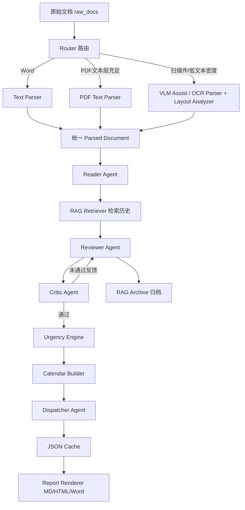
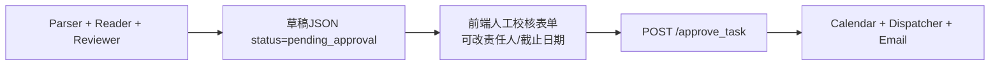

# 公文智能解析与任务编排系统（docs_agent）

本项目面向高校/政企场景下的通知、公文、制度类文件处理，提供从文档读取、结构化提取、任务审核、分派提醒、日历生成到报告输出的一体化流水线。

系统以中文场景为核心，支持 PDF 文本解析与 OCR 自动路由，输出可直接进入邮件、协同和管理流程的标准化结果。


[](https://github.com/SuYK-666/docs_agent/actions/workflows/ci.yml)
[](https://github.com/SuYK-666/docs_agent/stargazers)
[](https://github.com/SuYK-666/docs_agent/issues)

## 开源速览

1. 📄 许可证：MIT（见 [LICENSE](LICENSE)）。
2. 🤝 贡献指南：见 [CONTRIBUTING.md](CONTRIBUTING.md)。
3. 🧭 行为准则：见 [CODE_OF_CONDUCT.md](CODE_OF_CONDUCT.md)。
4. 🔒 安全报告：见 [SECURITY.md](SECURITY.md)。
5. 🧪 CI 校验：见 [.github/workflows/ci.yml](.github/workflows/ci.yml)。

## 近期升级亮点（2026-04）

基于最近一次完整运行（2026-04-05，6 条抓取，草稿 + 审批下发）日志，系统在吞吐与可观测性上已体现出并行改造收益：

| 观察项 | 日志证据 | 结果 |
| --- | --- | --- |
| 爬取与抽取已流式并发 | `DocumentStart(index=1/6)` 早于 `CrawlDispatchDone` | 爬虫未结束时，首批文件已进入抽取与复核链路（边爬边处理） |
| 草稿阶段并行生效 | `ParallelDraftStart workers=6 files=6` -> `ParallelDraftDone` | 6 份文件草稿阶段约 155 秒完成（15:15:26 -> 15:18:01） |
| 待审批总耗时明显下降 | `CrawlDispatchStart` -> `DraftPendingApproval` | 本次约 158 秒（15:15:25 -> 15:18:03），相较上一轮同类压测约 510 秒显著缩短 |
| 审批下发并行生效 | `ParallelApprovalStart workers=6 files=6` -> `ParallelApprovalDone` | 6 份文件审批并行阶段约 23 秒（15:18:17 -> 15:18:40） |
| 端到端审批闭环 | `ApprovalDispatchDone reports=6 email_sent=True` | 审批、渲染、邮件发送成功闭环（15:18:43 完成） |
| 稳定性改善 | `DraftRejected` 次数与 Reviewer 解析异常 | 本轮仅 1 次重审（83 分后二轮通过），未出现 Reviewer JSON 解析失败 |

本轮进一步完成了并发内核重构：线程池同步链路已迁移为全异步协程链路。

1. `DeepSeekClient -> Reader/Reviewer/Critic/Dispatcher -> Orchestrator` 统一 `async/await`。
2. UI 草稿与审批阶段改为 `asyncio` 批处理（`Semaphore` 限流 + `as_completed` 回收）。
3. Orchestrator 内置 LLM 并发闸门，按 `app.max_parallel_tasks` 控制峰值请求，降低高并发 429 风险。

RAG 侧已完成重写升级：

1. 元数据硬过滤：按 `doc_type` 写入归档并在向量检索阶段使用 `where` 强过滤。
2. 两阶段检索：先做向量粗召回（默认 15 候选），再用 CrossEncoder 重排打分。
3. 阈值截断：`rerank_score_threshold` 控制上下文注入强度，降低无关历史干扰。
4. 可靠性兜底：向量依赖异常时自动退回 JSONL 检索，避免业务中断。

本轮（2026-04）新增爬取可观测性与大批量稳定性优化：

1. 爬取阶段新增单独黑框（Crawler 单栏），与 Reader/Reviewer/Dispatcher 三栏解耦，抓取完成后立即停止计时与 token 统计。
2. 爬虫在发现可解析文件时即推送 `crawl_file_found` 事件，前端立刻创建该文件任务卡片并显示“已入队”。
3. 文档预处理阶段新增“识别/OCR 心跳”进度提示，避免长时 OCR 阶段前端无感卡住。
4. SSE 状态流新增 `from_seq` 续传与前端 `seq` 去重，修复断线重连后历史事件重复回放问题。
5. 增加 OCR 独立并发参数 `ingestion.ocr.max_parallel_files`（示例默认 10），与 LLM 并发限流分离控制。
6. Reviewer 每轮 Critic 分数通过流事件回传，前端在“[Reviewer 复核]”右侧显示最新轮次分数。
7. 爬取与草稿阶段改为流式并发：Crawler 每发现一个可解析文件即立刻启动该文件抽取/复核协程，不再等待“全量爬取完成后再统一开跑”。
8. Reviewer 轮次分数改为全量保留：若经历两轮复核，界面会持续显示“第1轮xx分 | 第2轮yy分”，不会在后续步骤被覆盖或丢失。
9. 爬取黑框文案从“泛化进度”改为“候选明细 + 单条抓取状态”，列表完成事件会直接带出候选标题清单。
10. 爬取阶段进度映射调整为真实 `0-100%`，并结合文件级阶段事件驱动任务条与总体条联动，减少机械跳值体感。

质量控制链路也已升级为闭环 Agentic Workflow：

1. 引入 Critic Agent：对草稿执行完整性、准确性、可执行性三维评分。
2. 引入 Reflection Loop：Reviewer 根据 Critic 反馈自动重构（可配置最大重试轮次）。
3. 低分兜底不崩溃：达到重试上限仍不通过时，产物写入低置信告警，交由人工审批重点校核。
4. 思考过程可追溯：最终产物 `pipeline_meta` 记录评分、重试次数与维度得分。
5. Reviewer 与 Critic 文本视野对齐：两者统一使用 14000 字符文档窗口，避免“Critic 看见但 Reviewer 看不见”的盲区死循环。
6. Reviewer 在收到 Critic 反馈时强制输出 `rework_thought` 字段（置于 tasks 前），先说明修正策略再落任务细化。
7. Critic 评分升级为量化扣分制：按完整性/准确性/可执行性逐项扣分，`total_score` 强制按三项平均值计算。
8. Reflection Loop 默认上限提升至 `max_rework_loops: 3`，并在反馈轮次对 Reviewer 提供小幅温度扰动以提升修复多样性。

### 工作量证明

为便于评审与验收，当前版本补充以下可复核证据：

1. 已将 VLM 辅助识别接入主流程：扫描件优先尝试 VLM，供应商不支持或调用失败时自动回退 OCR。
2. 路由层已透传运行时设置到解析层，确保“本次用户所选模型”可直接影响识别策略。
3. 文档与代码结构已完成一致性同步（目录树与模块说明对齐当前仓库状态）。

代码规模统计（包含代码、注释、空行）：

| 统计维度 | 文件数 | 总行数 |
| --- | ---: | ---: |
| 配置文件（config 下 .py/.yaml/.yml） | 4 | 616 |
| Agent 层（core_agent/*.py） | 6 | 2480 |
| 辅助功能（ingestion + tools_&_rag） | 10 | 4443 |
| 主函数入口（main.py） | 1 | 786 |
| 前端相关（html_console_server + html_templates） | 4 | 5722 |
| 输出交付模块（report_renderer + email_gateway） | 2 | 1535 |
| 其他 | 6 | 489 |
| 代码文件总计 | 33 | 16071 |

统计口径：仅统计 `.py/.yaml/.yml/.js/.css/.html`，排除 `.venv`、`__pycache__`、`data_workspace`、`log` 目录。

---

## 目录

1. 项目定位
2. 核心能力
3. 技术架构
4. 目录结构
5. 环境要求
6. 快速开始
7. 配置说明
8. 运行方式
9. 输出产物规范
10. 邮件网关与日历附件
11. 日志体系
12. RAG 检索与归档
13. 在线爬虫与自动下载
14. 紧急度机制
15. 开发与扩展建议
16. 常见问题
17. 安全建议
18. 版本演进建议
19. 开源协作与社区规范

---

## 1. 项目定位

### 1.1 解决的问题

1. 人工阅读公文效率低，任务信息分散且容易漏项。
2. 多来源文档（扫描件、文本 PDF、Word）处理方式不统一。
3. 下发提醒缺少结构化依据，跟踪与催办成本高。
4. 日历导入和邮件展示兼容性不足。
5. 历史经验难复用，审阅过程缺少上下文支撑。

### 1.2 目标输出

1. 标准化 JSON（含任务、风险、追问、调度内容、日历事件）。
2. 可导入日历的 ICS 文件（有明确时间的任务自动生成）。
3. 适合本地阅读与邮件投递的 Markdown/HTML/Word 报告（批量渲染时可按策略生成汇总 Markdown/HTML/Word）。
4. 可追溯的结构化日志（按运行时间命名，路径统一相对化）。

---

## 2. 核心能力

1. 多格式文档解析：DOCX、PDF、图片（PNG/JPG/JPEG/BMP/TIF/TIFF/WEBP）。
2. PDF 智能路由：自动判断文本层密度，按需切换文本解析或 OCR。
3. 多智能体流水线：Reader -> Reviewer -> Dispatcher。
4. VLM 辅助识别 + OCR 回退：扫描件场景下优先判断当前所选大模型是否支持视觉识别，支持则直接走 VLM 抽取，不支持或调用失败自动回退 OCR，并保留统一块级输出结构。
5. 风险与追问生成：对执行盲区、截止不清、交付不明进行提示。
6. 紧急度分级：红黄绿灰四级，支持边界告警可视化。
7. 日历事件生成：支持单日与日期范围任务生成事件。
8. 邮件兼容增强：HTML 样式内联，ICS 通过附件挂载，避免本地链接死链。
9. RAG 经验复用：历史结果自动归档，后续审阅可检索相似记录。
10. 全链路日志：按 STEP/AGENT/ACTION 记录决策过程，便于审计与排障。
11. 轻量前端控制台：单页完成配置、上传/粘贴、进度跟踪、报告预览与下载、邮件投递。
12. 多模型厂商切换：前端可选择并调用阿里通义、百度文心、DeepSeek、稿定设计、和鲸ModelWhale、即梦、豆包AI、讯飞星火、Kimi、腾讯混元、智谱AI。
13. 邮件附件类型可选发送：支持 Markdown/HTML/Word/ICS 多选，邮件模式下至少选择一项。
14. Human-in-the-Loop 状态机：先生成待审批草稿（pending_approval），人工确认后再执行日历生成、分发与邮件下发。
15. 全异步并发引擎：草稿与审批阶段统一使用 `asyncio` 协程批处理，支持 `Semaphore` 限流与按索引顺序回排。
16. SSE-first 状态流：前端优先使用 SSE 实时状态推送，异常场景自动回退轮询。
17. RAG 两阶段检索：`doc_type` 硬过滤 + 向量召回 + CrossEncoder 重排，提高上下文命中精度。
18. Critic 闭环优化：Reviewer 输出先经 Critic 评分，不达阈值则按反馈自动重构，提升抗幻觉能力。
19. Thinking Engine 三栏并发流：每份文件独占一行，行内固定 Reader/Reviewer/Dispatcher 三分栏，三栏独立状态、独立滚动、独立打字，按 `doc_id` 严格路由，确保并发下绝不串台。
20. 低频高效可视化：前端计时器本地 `setInterval` 维护，后端按心跳推送 `token_update`，避免高频状态抖动。
21. 爬虫过程可视化：crawl 循环内插桩 `current/total` 进度事件，并映射到 UI 进度条与 Thinking 面板，解决抓取阶段“卡 10%”体感。

---

## 3. 技术架构

### 3.1 处理流程



审批闭环（UI 场景）：



### 3.2 关键设计点

1. 路由先行：尽可能避免对文本型 PDF 做不必要 OCR，降低成本与耗时。
2. 先抽取再复核：Reader 负责结构化，Reviewer 负责一致性与可执行性校验。
3. 事件生成独立：日历逻辑与任务提取解耦，便于替换或增强。
4. 路径相对化：日志与产物元数据统一相对路径，便于部署迁移。
5. RAG 本地向量闭环：使用 ChromaDB + BAAI/bge-small-zh，本地持久化、HNSW（cosine）检索、动态阈值截断。
6. Orchestrator 双阶段接口：`generate_draft_plan()` 产出待审批草稿，`execute_dispatch_plan()` 在审批后执行下发。
7. 协程并发可回排：`asyncio.as_completed` 收集并发结果后按原始索引排序，保证后续产物顺序稳定。
8. 状态传输降噪：UI 状态更新采用 SSE 主通道，轮询仅作兼容兜底，减少高频 I/O 轮询压力。
9. 反思重构闭环：Reviewer 与 Critic 组成有界重试循环，按配置阈值执行“拒绝-修正-再评估”。
10. 低分兜底可解释：超过最大重试次数仍未达标时，不中断流程并输出低置信告警供人工重点复核。
11. 流式旁路可观测：LLM token 通过独立 stream 事件推送到前端 Thinking Engine，每条事件携带文档身份（`doc_id`）与节点身份（`agent`），并补充 `token_update` 与 `crawler_progress` 事件用于心跳计数与抓取进度。
12. 推送与渲染双向降噪：后端 token 做批量合并与结构噪声过滤，前端采用 buffer + 节流刷新 + 截断显示，降低长文本并发场景下的卡顿风险。

---

## 4. 目录结构

```text
docs_agent/
├─ config/
│  ├─ logger_setup.py
│  ├─ prompt_templates.py
│  ├─ settings.yaml
│  └─ settings.example.yaml
├─ core_agent/
│  ├─ agent_reader.py
│  ├─ agent_reviewer.py
│  ├─ agent_critic.py
│  ├─ agent_dispatcher.py
│  ├─ orchestrator.py
│  └─ security_filter.py
├─ ingestion/
│  ├─ router.py
│  ├─ text_parser.py
│  ├─ image_ocr_parser.py
│  ├─ layout_analyzer.py
│  └─ web_crawler.py
├─ tools_&_rag/
│  ├─ deepseek_client.py
│  ├─ urgency_engine.py
│  ├─ calendar_builder.py
│  ├─ rag_retriever.py
│  └─ vlm_ocr_assistant.py
├─ output_&_delivery/
│  ├─ html_console_server.py
│  ├─ report_renderer.py
│  ├─ email_gateway.py
│  ├─ html_templates/
│  │  ├─ index.html
│  │  ├─ styles.css
│  │  └─ app.js
│  └─ templates/
│     ├─ report_template.md
│     └─ report_template.html
├─ data_workspace/
│  ├─ raw_docs/
│  ├─ processed_cache/
│  ├─ rag_db/
│  └─ final_reports/
│     ├─ reports/
│     └─ *.ics
├─ log/
│  ├─ logging.yaml
│  └─ log_YYYYMMDD_HHMMSS.log
├─ main.py
└─ requirements.txt
```

---

## 5. 环境要求

1. Python 3.10+（推荐 3.12）。
2. Windows/Linux/macOS 均可，OCR 相关依赖在不同平台安装难度有差异。
3. 可访问至少一种兼容 Chat Completions 的模型服务（如 DeepSeek、阿里通义、百度文心、Kimi、豆包、混元、智谱等）。
4. 复杂版面感知依赖 opencv-python（已纳入 requirements.txt）。
5. 本地语义检索依赖 chromadb 与 sentence-transformers，Embedding 模型可配置为本地目录实现离线部署。

---

## 6. 快速开始

### 6.1 创建环境并安装依赖

```bash
python -m venv .venv
```

Windows PowerShell:

```powershell
.\.venv\Scripts\Activate.ps1
pip install -r requirements.txt
playwright install chromium
```

Linux/macOS:

```bash
source .venv/bin/activate
pip install -r requirements.txt
playwright install chromium
```

说明：`playwright install chromium` 仅首次执行需要，后续环境复用同一浏览器运行时即可。

### 6.2 准备输入文件

将待处理文件放入：

1. data_workspace/raw_docs

支持格式：

1. .docx
2. .pdf
3. .png/.jpg/.jpeg/.bmp/.tif/.tiff/.webp

### 6.3 配置模型参数

先复制配置模板：

1. `config/settings.example.yaml` -> `config/settings.yaml`

再编辑：

1. config/settings.yaml

至少确认所选模型厂商配置可用。

推荐做法：

1. 使用环境变量注入密钥，不要在 YAML 中放明文 Key。
2. 配置默认 provider（例如 `llm.provider=deepseek`），并配置对应环境变量名。
3. 可参考 `.env.example` 统一管理本地环境变量。

Windows PowerShell 示例（DeepSeek）：

```powershell
$env:DEEPSEEK_API_KEY="sk-xxxxxxxxxxxxxxxx"
```

Windows PowerShell 示例（阿里通义）：

```powershell
$env:DASHSCOPE_API_KEY="sk-xxxxxxxxxxxxxxxx"
```

---

## 7. 配置说明

主配置文件：config/settings.yaml

### 7.1 顶层配置项

| 配置组 | 说明 | 典型值 |
| --- | --- | --- |
| app | 运行环境、日志级别与并发控制 | environment, timezone, log_level, max_parallel_tasks, max_parallel_docs |
| paths | 工作目录配置 | raw_docs_dir, processed_cache_dir, rag_db_dir, final_reports_dir |
| rag | 本地向量检索与重排配置 | enabled, top_k, similarity_threshold, query_text_chars, collection_name, embedding_model, rerank_enabled, reranker_model, rerank_candidates, rerank_score_threshold, fallback_enabled, metadata_json_max_chars, dynamic_threshold.* |
| logging | 日志目录与配置文件 | dir, config_file, file |
| llm | 多模型路由配置 | provider, providers.provider_key.api_key/base_url/model 等 |
| deepseek | 模型服务配置 | base_url, model, timeout_seconds 等 |
| reader/reviewer/dispatcher | 各 Agent 参数 | json_retry_times, max_output_tokens 等 |
| critic | 质检与重构参数 | enabled, score_threshold, max_rework_loops, json_retry_times, max_output_tokens |
| orchestrator | 流程开关 | enable_reviewer, enable_dispatcher, generate_calendar |
| security_filter | 脱敏开关 | enabled |
| spiders | 爬虫规则与运行参数 | sites/*selectors, retry.*, humanize.*, playwright.*, auth.* |
| urgency | 紧急度阈值 | high_threshold, medium_threshold |
| calendar | 日历参数 | calendar_name, save_to_final_reports |
| ingestion | 解析链路参数 | router/ocr/layout 子项 |

并发参数补充说明：

1. `app.max_parallel_tasks` 为主并发参数，统一控制草稿批处理、审批批处理与 Orchestrator 的 LLM 限流上限。
2. `app.max_parallel_docs` 为兼容旧版本保留项；若同时配置，系统优先使用 `max_parallel_tasks`。
3. 默认推荐值为 `10`，可按模型配额与网络条件在 `5-15` 区间调优。

### 7.2 RAG 参数建议

1. `rag.embedding_model` 默认值为 `BAAI/bge-small-zh`，可替换为本地模型目录以满足离线部署。
2. `rag.collection_name` 默认 `docs_agent_archive`，建议按业务线拆分不同集合。
3. `rag.similarity_threshold` 默认 `0.75`，建议在 `0.70-0.85` 区间调优。
4. `rag.dynamic_threshold` 会按查询文本长度自动调整阈值，降低不相关上下文注入风险。
5. `rag.fallback_enabled=true` 建议保持开启，向量依赖异常时自动切换回退检索，保证业务不中断。
6. `rag.metadata_json_max_chars=0` 表示完整保存结构化 JSON 到向量元数据。
7. `rag.rerank_enabled=true` 时启用两阶段检索（粗召回 + 重排），推荐在生产保持开启。
8. `rag.reranker_model` 默认 `BAAI/bge-reranker-base`，首次加载可能触发模型下载。
9. `rag.rerank_candidates` 控制粗召回候选规模，默认 `15`，建议不低于 `top_k` 的 3 倍。
10. `rag.rerank_score_threshold` 默认 `0.5`，可在 `0.35-0.65` 区间按召回/精度平衡调优。
11. `doc_type` 硬过滤为内建策略：仅当当前公文类型有效时自动注入向量检索 `where` 条件。

### 7.3 Critic 参数建议

1. `critic.enabled=true` 时启用 Critic 评分与 Reflection Loop。
2. `critic.score_threshold` 默认 `85`，建议在 `80-90` 区间调优质量门槛。
3. `critic.max_rework_loops` 默认 `2`，建议保持 `2-3`，避免 Token 成本失控。
4. `critic.json_retry_times` 建议 `1-3`，用于稳住评分 JSON 解析。
5. `critic.max_output_tokens` 影响评分反馈详细度，默认 `1800`。
6. 当循环耗尽仍未达标时，最终产物会写入 `warning: Low confidence score: ...`，并在 `pipeline_meta` 留痕。

### 7.4 路由参数建议

1. pdf_mode=auto：推荐默认值。
2. pdf_text_page_ratio_threshold：文本页占比阈值，默认 0.6。
3. pdf_text_total_chars_threshold：总字符阈值，默认 180。

### 7.5 OCR 参数建议

1. engine=rapid：当前配置偏向稳定与轻量。
2. allow_fallback=true：遇到主引擎异常时自动回退，保证任务不中断。
3. dpi：影响清晰度与速度，默认 240。
4. ingestion.layout.pre_ocr_enabled=true：启用 OCR 前版面分析。
5. ingestion.layout.projection_two_column_enabled=true：启用双栏投影检测并自动左右切分。
6. ingestion.layout.table_detect_enabled=true：启用形态学表格线感知，用于复杂表格页识别。
7. ingestion.layout.red_stamp_hsv_filter=true：启用红色印章 HSV 过滤，减少红章对 OCR 干扰。
8. ingestion.vlm_assist.enabled=true：启用主流程 VLM 辅助识别；当所选 provider/model 支持视觉时优先使用 VLM，否则自动回退 OCR。
9. ingestion.vlm_assist.providers.*.model：为各厂商设置视觉模型（例如 qwen-vl-max、glm-4v-plus）；未配置或不可用时走回退逻辑。

### 7.6 多模型密钥注入建议

1. 推荐使用 `llm.provider` 指定当前厂商（例如 deepseek、tongyi、wenxin、kimi、hunyuan、zhipu）。
2. 推荐在 `llm.providers.provider_key.api_key_env` 中填环境变量名，并通过系统环境变量注入真实 Key。
3. `deepseek` 段仍保留兼容能力（老配置可继续工作）。
4. 不建议把 `sk-` 开头的真实密钥直接写入配置文件。

### 7.7 前端可选模型厂商

前端控制台内置可选项：

1. 阿里通义系列
2. 百度文心系列
3. DeepSeek
4. 稿定设计
5. 和鲸ModelWhale
6. 即梦
7. 豆包AI
8. 科大讯飞星火
9. Kimi
10. 腾讯混元系列
11. 智谱AI

说明：

1. 代码按 OpenAI Chat Completions 兼容方式调用，厂商基地址、模型名、认证头可在配置中覆盖。
2. 前端提交时会携带 `llm_provider`，后端按选择注入对应 provider 配置。

---

## 8. 运行方式

### 8.1 单文件运行（推荐日常）

```bash
python main.py --pipeline-mode orchestrator --save-cache --save-calendar
```

说明：

1. 不指定 --file 时，会从 raw_docs 选择最新文件。
2. --pipeline-mode 可选 orchestrator 或 reader。
3. --save-cache 会写入 processed_cache。
4. --save-calendar 会尝试生成 ICS（仅对有明确日期任务生效）。

可选参数：

1. --file 指定单个输入文件。
2. --config 指定配置文件路径。
3. --dispatch-owner 只生成某责任人的分派文案。
4. --preview-parse 仅预览解析文本，不调用 LLM。
5. --preview-chars 控制预览字符数。

爬虫参数：

1. --enable-crawler 启用阶段 0（爬虫喂料）。
2. --crawl-site 指定 settings.spiders.sites 下的站点规则键名。
3. --crawl-url 覆盖列表页 URL（沿用站点选择器规则）。
4. --crawl-count 指定抓取条数（如最近 5 条）。
5. --crawl-force 忽略 history_urls 去重，强制重抓。

示例（抓取最近 5 条并继续走原有 Agent 流程）：

```bash
python main.py --enable-crawler --crawl-site sample_notice_site --crawl-count 5 --pipeline-mode orchestrator --save-cache --save-calendar
```

### 8.2 仅渲染报告（基于已缓存 JSON）

```bash
python output_&_delivery/report_renderer.py --cache-dir data_workspace/processed_cache --output-dir data_workspace/final_reports/reports
```

说明：

1. 批量渲染会输出每份 JSON 对应的 .report.md 与 .report.html。
2. 同时额外输出汇总文件（按策略启用）：`公文速阅报告_YYYY年MM月DD日HH时MM分SS秒.docx/.md/.html`。

渲染单个 JSON：

```bash
python output_&_delivery/report_renderer.py --json-file data_workspace/processed_cache/xxx.agent.json
```

### 8.3 轻量前端控制台（单页）

推荐（已在 main.py 默认集成前端启动）：

```powershell
python main.py
```

或使用独立服务脚本：

```powershell
python "output_&_delivery/html_console_server.py" --host 127.0.0.1 --port 1708
```

浏览器访问：

1. <http://127.0.0.1:1708>

页面能力：

1. 顶部配置区：模型厂商选择、模型秘钥（支持小眼睛显隐）与收件邮箱输入。
2. 输入区：文件拖拽上传 + 多文件队列管理 + 文本粘贴。
3. 粘贴区支持“保存为 TXT 并加入队列”：可多次粘贴并保存为多份 txt，与上传文件混合后一批次处理。
4. 文本框支持剪贴板文件直接粘贴（如截图），会自动加入同一待处理队列。
5. 模式区：仅预览，或预览并自动发送邮件。
6. 邮件模式附件类型区：可多选 Markdown/HTML/Word/ICS，且至少选一项。
7. 每个报告格式支持单独策略下拉：逐文件，或汇总单份（多文件场景生效）。
8. 汇总文件命名统一为：`公文速阅报告_YYYY年MM月DD日HH时MM分SS秒.docx/.md/.html`。
9. 默认策略对 Word 使用“汇总单份”，减少多文件场景渲染耗时并提升投递效率。
10. 进度区：四阶段步进器（识别清洗 -> Reader -> Reviewer -> 渲染/投递）。
11. 结果区：iframe 在线预览 + HTML/MD/Word/ICS 下载 + 汇总文件下载（按产物可用性展示）。
12. 人工校核区：草稿阶段可编辑；人工确认后保留同一表格并切换为只读留痕。
13. 邮件发送成功后，底部会出现常驻状态提示（可手动关闭），便于过程追踪。
14. 任务状态优先使用 SSE 流式更新（`/api/jobs/{job_id}/events`），断连后自动退回轮询。
15. Thinking Engine 面板改为“按文件分行 + 行内三栏”：每份输入文件占据独立一行，行内固定 Reader/Reviewer/Dispatcher 三栏，三栏独立状态、独立滚动、独立输出。
16. 每个文件行头部显示本地计时器与 Token 计数：计时器在前端本地驱动，Token 计数由后端 `token_update` 心跳更新。

补充说明：

1. 前端会将模型厂商、秘钥与邮箱缓存到浏览器本地存储（localStorage）。
2. 状态获取采用 SSE-first，若浏览器或网络不支持 SSE，会自动降级为低频轮询。
3. 提交任务时，会将“已上传文件 + 已保存的粘贴文本（txt）+ 剪贴板文件”一起打包为同一批次。
4. 多文件审批前阶段默认仅强制生成单文件 HTML 预览，其余格式按策略延后或汇总输出，可显著降低总耗时。
5. SSE 通道除 `job` 事件外，`stream` 事件支持 `token` / `token_update` / `crawler_progress`。推荐消息结构示例：`{"doc_id":"文件A","agent":"Reader","event":"token","text":"请"}`、`{"doc_id":"文件A","event":"token_update","tokens":150}`；前端依据 `doc_id` 与 `agent` 路由到对应三栏，仅用于可视化，不参与审批数据写回。

### 8.5 人工确认接口

审批提交接口：

1. `POST /approve_task`

请求体示例：

```json
{
  "job_id": "<job_id>",
  "drafts": [
    {
      "draft_token": "<draft_token>",
      "draft_json": {
        "doc_id": "xxx",
        "status": "approved",
        "tasks": [
          {
            "task_id": "task_1",
            "owner": "责任部门",
            "deadline_display": "2026-12-31"
          }
        ]
      }
    }
  ]
}
```

返回语义：

1. 受理成功时返回 `202 Accepted`，状态轮询继续通过 `/api/jobs/{job_id}` 获取。
2. 后端会覆盖本地 cache 中对应草稿，再执行 Calendar/Dispatcher/Email 阶段。

---

## 9. 输出产物规范

### 9.1 JSON 缓存

位置：data_workspace/processed_cache

文件名：

1. 文档ID.agent.json（orchestrator）
2. 文档ID.reader.json（reader-only）

关键字段：

1. doc_id/title/document_no/publish_date/doc_type
2. tasks[]（task_id/task_name/owner/deadline/deadline_start/deadline_end/deadline_display/deliverables/action_suggestion/source_anchor/urgency）
3. risks_or_unclear_points[]
4. follow_up_questions[]
5. summary
6. calendar（event_count/events/ics_file）
7. dispatch（email_subject/email_body_markdown/instant_message/follow_up_tips）
8. pipeline_meta
9. status（例如 pending_approval、approved、dispatched）
10. approval（required/approved_at/approved_by）

### 9.2 日历文件

位置：data_workspace/final_reports

规则：

1. 仅当存在可解析日期任务时生成。
2. 同时支持单日和范围日期任务。

### 9.3 报告文件

位置：data_workspace/final_reports/reports

类型：

1. .report.md
2. .report.html
3. .report.docx（单文件渲染）
4. 公文速阅报告_YYYY年MM月DD日HH时MM分SS秒.docx/.md/.html（批量汇总，按策略生成）

---

## 10. 邮件网关与日历附件

实现文件：output_&_delivery/email_gateway.py

### 10.1 当前策略

1. 邮件 HTML 发送前进行 CSS 内联（premailer）。
2. 任务区域不再依赖本地 file:// 日历链接。
3. ICS 作为标准邮件附件挂载，由邮箱客户端原生渲染“加入日历”。
4. 附件路径在 payload 中统一采用相对路径描述。
5. send_formal_reports_bundle 支持按 attachment_types 动态选择附件类型（md/html/docx/ics）。
6. 邮件模式要求至少选择一种附件类型，前后端均做校验。
7. 正文会汇总每篇通知的“通知标题、核心摘要、任务简述、Deadline”，并动态显示附件构成。
8. 邮件模式默认走人工确认闭环：草稿待审批前不会触发邮件发送。

### 10.2 推荐接入方式

1. 先用报告 HTML 作为邮件正文模板。
2. 构建邮件 payload 时传入 agent_output，让网关自动识别并挂载 ICS。
3. 若有额外附件，可同时通过 extra attachments 注入。

### 10.3 复用现有产物直接发送

适用于“已生成缓存与报告，不重跑 pipeline 仅重发邮件”的场景：

```python
import sys
from pathlib import Path

project_root = Path.cwd()
sys.path.insert(0, str(project_root / "output_&_delivery"))

import email_gateway

result = email_gateway.send_formal_reports_bundle(
    recipient_email="your_mail@example.com",
    reports_dir="data_workspace/final_reports/reports",
    cache_dir="data_workspace/processed_cache",
  attachment_types=["html", "docx", "ics"],
)
print(result)
```

---

## 11. 日志体系

### 11.1 日志位置与命名

1. 目录：log
2. 文件：log_YYYYMMDD_HHMMSS.log
3. 控制项：config/settings.yaml 的 logging 段 + log/logging.yaml

### 11.2 日志格式

采用统一结构：

1. STEP=...
2. AGENT=...
3. ACTION=...
4. DETAILS=...

示例语义：

1. 路由决策（文本解析或 OCR）
2. LLM 请求轮次、provider 与结果
3. Calendar 生成状态
4. 报告渲染完成状态

### 11.3 路径规范

系统已统一输出相对路径，便于：

1. 本地开发环境迁移
2. CI/CD 与服务器部署
3. 邮件系统和下游服务消费

### 11.4 性能观测建议（重点看这些 ACTION）

1. 草稿并行：`ParallelDraftStart` / `ParallelDraftDone`。
2. 审批并行：`ParallelApprovalStart` / `ParallelApprovalDone` / `ApprovalDispatchDone`。
3. SSE 状态通道：`GET /api/jobs/<job_id>/events`。
4. 节点流式事件：SSE `event: stream`，payload 含 `doc_id/agent/event/text`，并可附带 `tokens`（心跳）与 `current/total`（爬虫进度）。
5. RAG 模式判定：`RAG向量引擎就绪`、`RAG重排模型就绪`、`RAG向量检索不可用`、`RAG回退检索完成`。
6. Critic 闭环：`CriticStart` / `CriticDone` / `DraftRejected` / `DraftLoopExhausted`。

---

## 12. RAG 检索与归档

实现文件：tools_&_rag/rag_retriever.py

### 12.1 技术选型与合规

1. 向量引擎：ChromaDB，本地 Python 进程运行，持久化目录为 `data_workspace/rag_db/chroma`。
2. Embedding 模型：`BAAI/bge-small-zh`，默认 CPU 推理，适合普通办公终端。
3. 检索索引：Collection 显式使用 HNSW + cosine 距离。
4. 合规策略：向量化与检索均在本地闭环执行，不调用第三方云端向量 API。

### 12.2 检索链路（硬过滤 + 两阶段重排）

1. 引擎初始化：启动时挂载 ChromaDB PersistentClient，并创建/复用 Collection。
2. 特征归档：审阅完成后抽取 summary/tasks/risks/doc_type，写入向量文档与元数据（含 `doc_type` 归一化）。
3. 第一阶段（粗召回）：向量检索拉取 `max(rerank_candidates, top_k)` 候选；若当前公文 `doc_type` 有效，自动注入 `where={"doc_type": ...}` 硬过滤。
4. 第二阶段（重排）：使用 CrossEncoder（默认 `BAAI/bge-reranker-base`）对 query-candidate 对打分并排序。
5. 阈值截断：仅保留 `rerank_score >= rerank_score_threshold` 的候选，构造最终历史上下文。

### 12.3 依赖缺失回退模式

1. 若运行环境缺少 `chromadb` / `sentence-transformers`，系统不会中断。
2. 若仅重排依赖不可用，会自动回退到“向量召回 + 向量排序”。
3. 若向量依赖不可用，会自动切换到本地 JSONL 回退检索（`data_workspace/rag_db/archive_db.jsonl`）。
4. 恢复依赖后，系统自动回到“向量检索 + 重排优先 + 回退兜底”模式。

### 12.4 冷启动说明

首次运行向量库为空时，日志会显示“命中=0”，属于正常现象。

建议做法：

1. 先导入 2-5 份历史公文形成初始归档。
2. 再处理新公文观察 Reviewer 是否引用到历史模式。

---

## 13. 在线爬虫与自动下载

实现文件：ingestion/web_crawler.py

### 13.1 设计原则（Crawler as Feeder）

1. 爬虫只负责“喂料”，不直接调用 Agent。
2. 成功抓取统一落盘到 `raw_docs`，失败抓取统一落盘到 `processed_cache` 的标准错误 JSON。
3. 抓取失败不会导致流水线崩溃，失败项会直接进入报告渲染环节，形成可审计告警闭环。

### 13.2 站点规则配置

配置路径：settings.spiders.sites.<site_key>

字段说明：

1. list_url：通知列表页 URL。
2. list_selector：可选兼容字段（当前列表提取已改为启发式，不再依赖该选择器）。
3. title_selector：详情页标题选择器（作为标题提取优先项）。
4. content_selector：详情页正文选择器（仅在算法抽取失败时作为回退）。
5. attachment_selector：附件链接选择器。

运行时策略配置（settings.spiders）：

1. retry.max_retries / retry.backoff_base_seconds：指数退避重试参数。
2. humanize.sleep_min_seconds / humanize.sleep_max_seconds：拟人化随机间隔。
3. humanize.user_agents：可选 UA 池，未配置时使用内置 UA 池随机轮换。
4. playwright.headless / browser_channel / wait_network_idle：浏览器渲染策略（默认使用 networkidle 等待页面稳定）。
5. auth.storage_state_file：Cookie 状态持久化文件。
6. auth.allow_manual_login：登录失效时是否允许人工登录刷新状态。

### 13.3 增量抓取机制

1. 历史记录文件：data_workspace/history_urls.json。
2. 每次抓取先查历史 URL，已处理链接自动跳过。
3. 使用 --crawl-force 可忽略历史去重。

### 13.4 内置防御策略

1. 动态渲染：基于 Playwright 无头 Chromium，页面加载阶段统一使用 `wait_until=networkidle`，不依赖固定 CSS 节点等待。
2. 启发式列表提取：渲染完成后遍历全量 `<a>` 标签，按“标题关键词命中（通知/公示/竞赛/管理办法等）或标题长度阈值（>=10）”筛选候选通知链接。
3. 智能路由（Smart Routing）：进入详情抓取前先嗅探 URL 后缀，`.pdf/.docx/.zip` 等文件链接走“直连下载模式”，普通网页链接走“浏览器渲染模式”。
4. 二进制直连下载：文件型链接使用 `httpx` 直接 GET 落盘到 `raw_docs_dir`，下载后的本地文件直接作为后续 Router/Parser 的输入源。
5. 智能正文提取：网页型链接渲染后 HTML 交由 Trafilatura 进行主内容抽取，降低导航栏/版权区噪声。
6. 身份态管理：支持 `storage_state_file` Cookie 持久化；登录态失效时可触发人工登录刷新。
7. 拟人化访问：每次请求随机轮换 UA，并在多链接间随机 sleep（默认 1.5s-3.5s）。
8. 优雅重试：超时、429、502/503/504 默认指数退避重试（2s -> 4s -> 8s）。

### 13.5 输出行为

1. 网页型通知会生成正文 `.txt` 文件。
2. 文件型通知（如 `.pdf/.docx/.zip`）会直接下载原文件到 `raw_docs_dir`，并作为解析流水线输入。
3. 匹配附件选择器的链接会自动下载并防重名。
4. 文件名默认附加通知标题前缀，便于追溯来源。
5. 抓取失败会生成标准错误 JSON（含 `status=failed/reason/url/step`）。
6. Main 流程会直接渲染失败报告（MD/HTML/Word），并在报告中红色标记“请人工核实原链接”。

---

## 14. 紧急度机制

实现文件：tools_&_rag/urgency_engine.py

分级：

1. HIGH（红色）
2. MEDIUM（黄色）
3. LOW（绿色）
4. NONE（灰色）

评分来源：

1. 截止时间距离
2. 关键词权重（如“立即”“务必”等）
3. 长效任务兜底逻辑

建议在验收阶段补充边界样本：

1. 截止“明天/后天”验证红黄告警视觉。
2. 长效机制验证灰色展示。

---

## 15. 开发与扩展建议

1. 将邮件发送器（SMTP/企业邮箱 API）与 email_gateway payload 解耦为独立适配层。
2. RAG 已升级为本地向量库，建议补充离线模型预热脚本与向量库定期压缩策略。
3. 增加端到端回归样本集，覆盖：文本 PDF、扫描 PDF、混合版面、日期范围任务。
4. 在 CI 中加入 py_compile + 静态检查，保证提交质量。
5. 对 OCR 依赖做按需安装说明（轻量/全量 profile）。

---

## 16. 常见问题

### 16.1 OCR 速度慢

1. 降低 dpi（如 240 -> 200）。
2. 优先使用文本解析路由（确保 PDF 有文本层）。

### 16.2 无法生成 ICS

1. 任务截止字段可能为长期/按需/未提及。
2. 检查 deadline_start/deadline_end 是否标准化为日期。

### 16.3 邮件样式丢失

1. 确认发送前经过 CSS 内联。
2. 避免依赖复杂选择器或外链样式。

### 16.4 RAG 一直为 0 条

1. 检查 rag.enabled 是否为 true。
2. 检查 `data_workspace/rag_db/chroma` 是否已生成集合文件。
3. 检查 `rag.similarity_threshold` 是否过高，可先降到 0.70 观察召回。
4. 若日志提示缺少 chromadb 依赖，系统会进入 JSONL 回退检索；此时可继续使用并补装向量依赖以恢复向量模式。

### 16.5 爬虫抓不到正文或附件

1. 先确认已执行 `playwright install chromium`。
2. 检查 `spiders.playwright.headless=false` 后本地可否正常打开目标页（排查 WAF 或登录跳转）。
3. 若命中登录页，开启 `spiders.auth.allow_manual_login=true` 后重跑并在弹窗内完成一次登录。
4. 若列表抓取结果偏少，优先检查公告标题是否包含启发式关键词（通知/公示/竞赛/管理办法）或标题长度是否过短。
5. 若链接是直接文件（PDF/Word/压缩包），系统会走直连下载而非页面渲染；可先验证该 URL 在浏览器是否可直接下载。
6. 若正文抽取质量下降，可优先优化 `title_selector/content_selector/attachment_selector`，再观察 Trafilatura 提取结果。

### 16.6 抓取中文乱码

1. 在 spiders.force_encoding 中显式设置 utf-8 或 gb18030。
2. 若站点编码不稳定，可先保持 force_encoding 为空走自动识别。

### 16.7 切换模型厂商后调用失败

1. 检查所选厂商的 API Key 是否有效，以及账号余额/配额是否正常。
2. 检查 `llm.providers.provider_key` 的 `base_url/model/chat_completions_path` 是否与厂商文档一致。
3. 若厂商鉴权头不是 Bearer，可配置 `auth_header_name/auth_header_prefix` 覆盖默认值。

### 16.8 多文件处理耗时较高

1. 将 Word/Markdown/HTML 输出策略调整为“汇总单份”，可减少报告渲染与附件构建耗时。
2. 审批前阶段仅强制生成 HTML 预览，其余格式建议在审批后再生成。
3. 优先使用稳定网络，降低 LLM 请求重试带来的额外时延。
4. 可在 `app.max_parallel_tasks` 调整并行处理数（建议 5-15）；若出现 429 或重试增多，建议下调 2-3 档观察。

---

## 17. 安全建议

1. 不要在配置文件明文写入生产密钥。
2. 优先通过环境变量注入 API Key。
3. 对外分发报告前，确认脱敏策略符合组织规范。
4. 日志中避免输出可识别个人敏感信息。

---

## 18. 版本演进（功能迭代轨迹）

### v1：基础能力成型

1. 建立 Reader -> Reviewer -> Dispatcher 的基础多智能体链路。
2. 支持公文结构化抽取与标准 JSON 输出。
3. 形成 Markdown/HTML 报告渲染与日志审计闭环。

### v2：解析引擎增强

1. 路由层支持 Word/PDF/图片多格式入口。
2. PDF 引入文本解析与 OCR 双通道自动切换。
3. 复杂版面加入双栏切分、红章过滤、文本块重排，提升公文还原质量。

### v3：流程从“生成”升级到“可审批”

1. 引入 Human-in-the-Loop 状态机，草稿先进入 `pending_approval`。
2. 新增 `approve_task` 二段式执行，审批后才触发日历/分发/邮件。
3. 审批修订可回写本地缓存，保证后续产物与人工决策一致。

### v4：并发架构重构

1. 主链路迁移为 `async/await` 协程执行模型。
2. 草稿与审批阶段引入 `Semaphore` 限流并行批处理。
3. 增加并发闸门控制峰值请求，降低高并发下 429 风险。

### v5：RAG 从“可用”升级到“可控”

1. 建立 `doc_type` 元数据硬过滤，先约束再检索。
2. 检索升级为“向量粗召回 + CrossEncoder 重排 + 阈值截断”。
3. 向量依赖异常时自动回退 JSONL 检索，保证流程不中断。

### v6：实时可观测能力完善

1. 状态通道升级为 SSE-first，支持断线续传与 `seq` 去重。
2. Thinking Engine 升级为 Reader/Reviewer/Dispatcher 三栏并发流。
3. 增加 token 心跳与阶段事件，显著降低前端“假卡住”体感。

### v7：爬取与草稿阶段流式并发

1. Crawler 发现可解析文件后立即入队，不再等待全量抓取完成。
2. 爬取黑框支持候选清单与单条明细状态，提升可解释性。
3. 进度映射升级为真实 `0-100%`，总体/任务进度联动更自然。

### v8：质量闭环稳定性增强（当前版本）

1. Critic 升级为量化扣分制，输出结构化“扣分原因/原文依据/修改指令”。
2. Reviewer 与 Critic 文本视野对齐（14000 字符），修复“看见范围不一致”导致的循环重审问题。
3. Reviewer 在反馈轮强制输出 `rework_thought`，并加入小幅温度扰动以提高修复成功率。
4. 反思轮上限提升到 `max_rework_loops: 3`，提高复杂文档自愈能力。
5. Reader/Reviewer 增强 JSON 截断容错与降级保护，避免单文档异常拖垮整批任务。
6. Reviewer 输出上限提升到 `max_output_tokens: 4096`，降低长 JSON 被截断概率。

### 下一版本建议（v9）

1. 引入“任务级证据对齐检查”：Critic 对每个任务输出证据引用校验结果，减少主观扣分波动。
2. 引入“动态输出预算控制”：按文档长度与任务复杂度自适应分配 Reader/Reviewer token 上限。
3. 增加“质量回归基准集”：固定样本自动回放，持续跟踪通过率、重审率、解析失败率。
4. 增强“失败隔离能力”：单文档重试与降级策略可独立配置，不影响同批次其他文档吞吐。
5. 增加“运营侧质量看板”：展示评分分布、重试热区、常见扣分类型与改进建议。

---

## 19. 开源协作与社区规范

### 19.1 许可证

本项目采用 MIT License，详见 [LICENSE](LICENSE)。

### 19.2 贡献、行为准则与变更记录

1. 贡献流程与提交规范：见 [CONTRIBUTING.md](CONTRIBUTING.md)。
2. 社区行为准则：见 [CODE_OF_CONDUCT.md](CODE_OF_CONDUCT.md)。
3. 版本变更记录：见 [CHANGELOG.md](CHANGELOG.md)。
4. 开源发布检查清单：见 [OPEN_SOURCE_CHECKLIST.md](OPEN_SOURCE_CHECKLIST.md)。

### 19.3 安全与漏洞反馈

安全策略与私下漏洞报告方式见 [SECURITY.md](SECURITY.md)。

### 19.4 贡献者头像

[](https://github.com/SuYK-666/docs_agent/graphs/contributors)

Issue/PR 模板已内置在 [.github/ISSUE_TEMPLATE](.github/ISSUE_TEMPLATE) 与 [.github/pull_request_template.md](.github/pull_request_template.md)，可直接启用。
